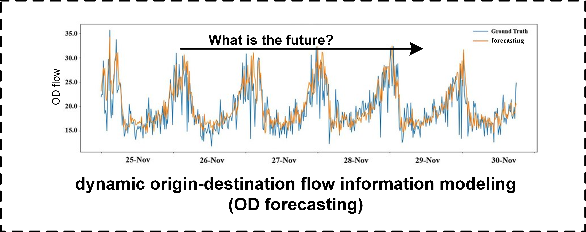
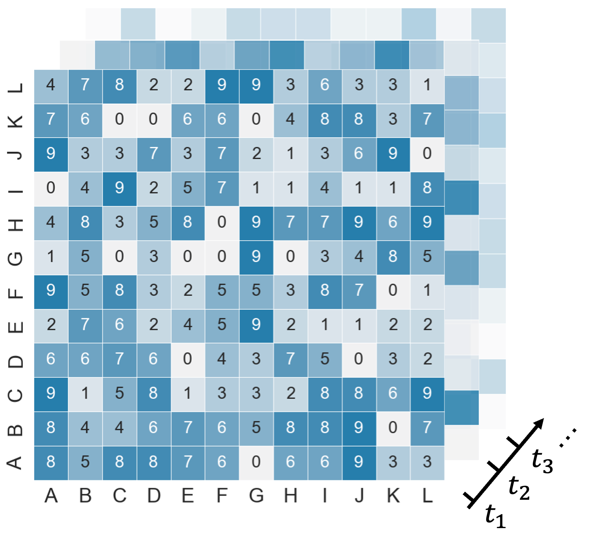
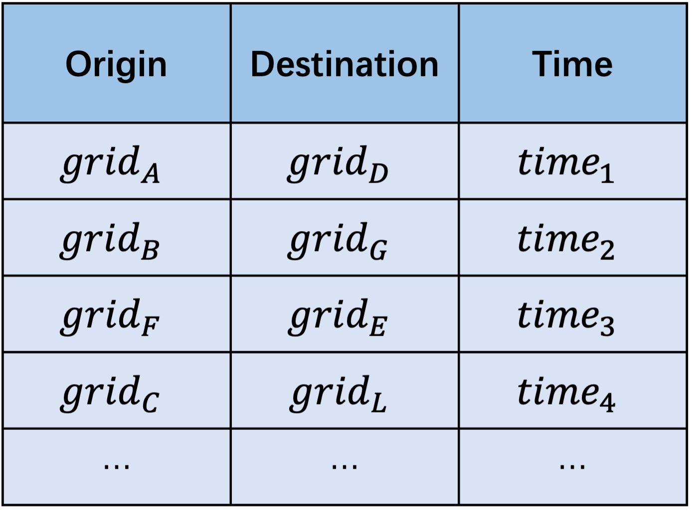

# OD forecasting benchmark



**Problem Definition.** Given a historical dataset of OD flows $\lbrace f^t_{ij} | t= 1,2,...,k-1 \rbrace$ over a certain period of time, the objective is to forecast the OD flows for future time periods $\lbrace f^t_{ij} | t=k,k+1,... \rbrace$.

## Requirements

```
dgl==1.1.0
matplotlib==3.1.1
numpy==1.21.6
pandas==1.1.5
Pillow==9.5.0
scikit_learn==0.24.2
scipy==1.3.1
tensorflow==2.12.0
tf_slim==1.1.0
torch==1.13.1
torch_geometric==2.3.1
tqdm==4.62.3
```

## Data Description


Firstly, divide the area to be studied into several grids on the map.



In every slot, $X \in R(N,N)$ ,  $N$ is the number of grids. $x_{ij}$ represents the volume of $i \rightarrow j$.



## Systematic Comparison of Methods

| model | Spatial Topology Construction | Spatial Feature Modeling | Temporal Modeling | Learning |
| ----- | -----                         | -----                    | -----             | -----             |
| [GEML](./models/GEML/)  | grids as nodes <br> geo-adjacency graph <br> POI-similarity graph | GCN                         |  LSTM             | multi-task learning              |
| [MPGCN](./models/MPGCN/) | regions as nodes<br>distance-based graph<br>POI-similarity graph<br>OD flow-based graph | 2DGCN | LSTM | MSELoss |
| [Gallet](./models/Gallet/) | regions as nodes<br>OD flow-based graph<br>distance-based graph | spatial attention | temporal attention | MSELoss |
| [gMHC-STA](./models/gMHC-STA/) | region-pairs as nodes<br>fully-connected graph | GCN + spatial attention | self-attention | MSELoss |
| [ST-VGCN](./models/STVGCN/) | region-pairs as nodes<br>OD flow-based graph | GCN + gated mechanism | GRU | MSELoss|
| [MVPF](./models/MVPF/) | stations as nodes<br>distance-based graph | GAT | GRU | MSELoss |
| [Hex D-GCN](./models/Hex_DGCN/) | hexagonal grids as nodes<br>taxi path-based dynamic graph | GCN | GRU | MSELoss |
|[CWGAN-GP](./models/) | OD matrix as an image | CNN | CNN | GAN-based training |
| [SEHNN](./models/) | stations as nodes<br>geo-adjacency graph| GCN | LSTM | VAE-based training |
| [HC-LSTM](./models/) | grids as nodes<br>OD flow-based graph<br>in/out flow as an image<br>OD matrix as an image | CNN + GCN | LSTM | MSELoss |
| [ST-GDL](./models/ST-GDL/) | regions as nodes<br>distance-based graph |CNN + GCN | CNN | MSELoss |
| [PGCN](./models/PGCN/) | region pairs as nodes<br>OD flow-based graph | GCN + gated mechanism | none | probabilistic inference<br>with Monte Carlo |
| [MF-ResNet](./models/) | OD matrix as an image | CNN | none | MSELoss |
| [TS-STN](./models/) | stations as nodes<br>OD flow-based graph | temporally shifted<br>graph convolution | LSTM + attention | Partially MSELoss |
| [DMGC-GAN](./models/) | regions as nodes<br>geo-adjacency graph<br>OD flow-based graph<br>in/out flow-based graph |GCN | GRU | GAN-based training |
| [DNEAT](./models/) | regions as nodes<br>geo-adjacency graph<br>OD flow-based graph | attention | attention | MSELoss |
| [CAS-CNN](./models/CA-SATCN/) | OD matrix as image | CNN | channel-wise attention | masked MSELoss |
| [ST-ED-RMGC](./models/) | region pairs as nodes<br>fully-connected graph<br>geo-adjacency graph<br>POI-based graph<br>disntance-based graph<br>OD flow-based graph | GCN | LSTM | MSELoss |
| [HSTN](./models/) | regions as nodes<br>geo-adjacency graph<br>in/out flow-based graph | GCN | GRU+Seq2Seq | MSELoss |
| [BGARN](./models/BGARN/) | grid clusters as nodes<br>distance-based graph<br>OD flow-based graph | GCN + attention | LSTM | MSELoss |
| [HMOD](./models/HMOD/) | regions as nodes<br>OD flow-based graph | random walk for embedding | GRU | MSELoss |
| [STHAN](./models/STHAN/) | regions as nodes<br>geo-adjacency graph<br>POI-based graph<br>OD flow-based graph | convolution by meta-paths + attention | GRU | MSELoss |
| [ODformer](./models/ODformer/) | regions as nodes | 2D-GCN within Transformer | none | MSELoss |
| [CMOD](./models/CMOD/) | stations as nodes<br>passengers as edges | multi-level information aggregation | multi-level information aggregation | continous time forecasting |
| [MIAM](./models/MIAM/) | stations as nodes<br>railway-based graph | GCGRU | Transformer | online forecasting |
| [DAGNN](./models/DAGNN/) | regions as nodes<br>fully-connected graph | subgraph + GCN | TCN | MSELoss |


## Performance Comparison


| model | RMSE | NRMSE | MAE | MAPE | sMAPE |
| ----- | ----- | ----- | ----- | ----- | ----- | 
| [LSTNet](./models/LSTNet/)  |  |       |24.5363|0.5161|       |
| [GCRN](./models/GCRN/)  | 120.2321 |       |24.5363|0.5161|       |
| [GEML](./models/GEML/)  | 113.8526 |       |39.5888|3.1885|       |
| [MPGCN](./models/MPGCN/) | 1.1421 |       |     |      |       |
| [PGCN](./models/PGCN/) |      |       |     |      |       |
| [ST-GDL](./models/ST-GDL/) |      |       |     |      |       |
| [Gallet](./models/Gallet/) | 1081.1332|       |355.7162|0.6623|       |
| [Hex D-GCN](./models/Hex_DGCN/) |      |       |     |      |       |
| [BGARN](./models/BGARN/) | 52.2182|       |10.3148|0.5017|       |
| [CMOD](./models/CMOD/) |      |       |     |      |       |
| [AEST](./models/AEST/) |      |       |     |      |       |
<!-- | [HMOD](./models/HMOD/) |      |       |     |      |       |
| [MVPF](./models/MVPF/) |      |       |     |      |       |
| [DDW](./models/DDW/) |      |       |     |      |       |
| [ST-VGCN](./models/STVGCN/) |      |       |     |      |       |
| [CA-SATCN](./models/CA-SATCN/) |      |       |     |      |       |
| [ODformer](./models/ODformer/) |      |       |     |      |       |
| [HIAM](./models/HIAM/)|      |       |     |      |       |
| [STHAN](./models/STHAN/) |      |       |     |      |       | -->

## The performance comparison will be completed soon.