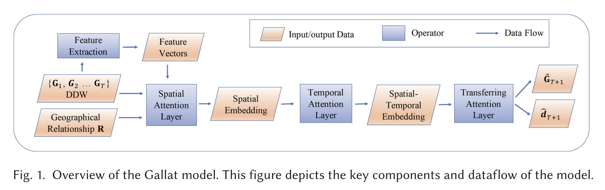

# DDW
## Title
《Passenger Mobility Prediction via Representation Learning for Dynamic Directed and Weighted Graphs》

## Reference
Wang Y, Yin H, Chen T, et al. Passenger mobility prediction via representation learning for dynamic directed and weighted graphs[J]. ACM Transactions on Intelligent Systems and Technology (TIST), 2021, 13(1): 1-25.

## Paper Link
https://dl.acm.org/doi/abs/10.1145/3446344

## Overview
