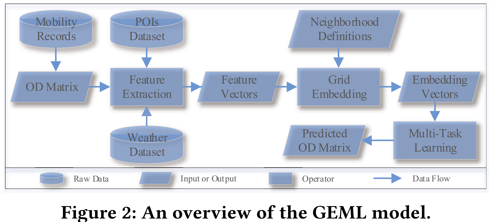

# GEML

## Title

《Origin-Destination Matrix Prediction via Graph Convolution: a New Perspective of Passenger Demand Modeling》 

## Reference
Wang Y, Yin H, Chen H, et al. Origin-destination matrix prediction via graph convolution: a new perspective of passenger demand modeling[C]//Proceedings of the 25th ACM SIGKDD international conference on knowledge discovery & data mining. 2019: 1227-1235.

## Paper Link
https://dl.acm.org/doi/abs/10.1145/3292500.3330877

## Overview

