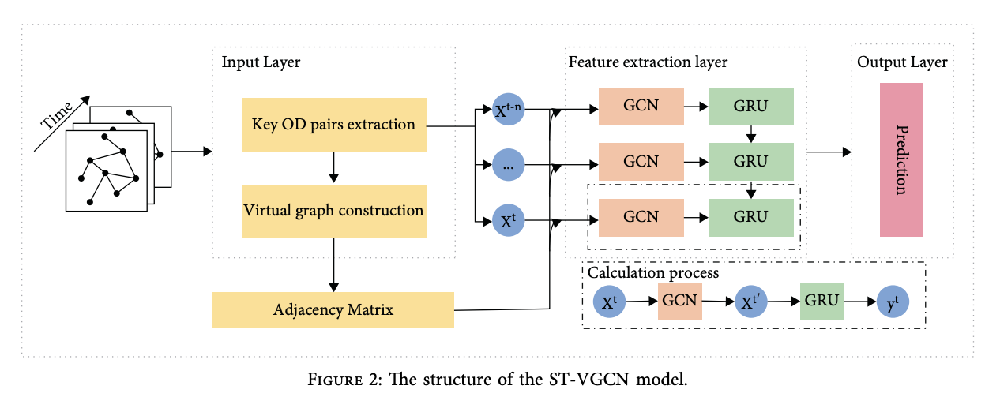

# ST-VGCN

Title: 《Spatiotemporal Virtual Graph Convolution Network for Key Origin-Destination Flow Prediction in Metro System》 

Reference: Yang J, Han X, Tan Y, et al. Spatiotemporal Virtual Graph Convolution Network for Key Origin-Destination Flow Prediction in Metro System[J]. Mathematical Problems in Engineering, 2022, 2022.

Paper Link: https://downloads.hindawi.com/journals/mpe/2022/5622913.pdf

graph: 

